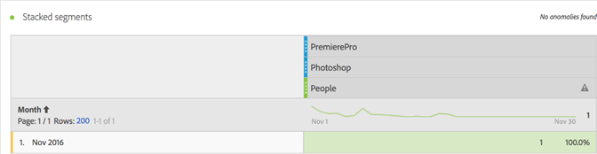

# Métrica Personas{#people-metric}

La métrica Personas es el número de personas (o grupos de dispositivos) en función de Device Graph de Adobe. Puede aplicar la métrica Personas en Analysis Workspace para identificar visitantes en sus distintos dispositivos.

## People Metric Prerequisites and Considerations {#section-34551d0435fb4b3cb3fad736b7961541}

<table id="table_120F7EF50042485391E58B22DD00A2A8"> 
 <thead> 
  <tr> 
   <th colname="col1" class="entry"> Requisito previo o consideración </th> 
   <th colname="col2" class="entry"> Descripción </th> 
  </tr>
 </thead>
 <tbody> 
  <tr> 
   <td colname="col1"> 
Device Co-op 
 </td> 
   <td colname="col2"> 
 To use the People metric, become a member of the <a href="http://landing.adobe.com/en/na/events/summit/275658-summit-co-op.html" format="html" scope="external"> Adobe Experience Cloud Device Co-op</a>. La cooperación identifica varios dispositivos de una persona (o ID de Experience Cloud). Analytics aprovecha esta información para derivar de forma estadística el número de personas que interactúan con una marca. La métrica tiene una precisión del 5 %. 
 
<b>Regiones</b>: en este momento, Device Co-op solo está disponible en Estados Unidos y Canadá. Por tanto, al evaluar la métrica Personas debería aplicar al análisis un segmento que filtre los datos solo para estos dos países. 
 
Cada semana, Device Graph calcula una nueva versión de la cooperación y la publica para su uso. Los martes, el sistema recopila los datos más recientes y publica una versión actualizada del gráfico. Las soluciones de Experience Cloud utilizan la versión más reciente del gráfico. Específicamente para Analytics, los cambios se leen los miércoles y el procesamiento de los cambios suele tardar entre 1 y 2 días hábiles. 
 
 
Importante:  Cuando el gráfico se actualiza semanalmente, puede afectar históricamente a la métrica Personas. En otras palabras, los recuentos históricos de personas pueden cambiar con el tiempo a medida que el gráfico aprende y se actualiza. Por ejemplo: si ejecuta un informe hoy que cuenta Personas el mes pasado y luego ejecuta el mismo informe en una semana después de que se actualice el gráfico, el recuento de Personas histórico puede cambiar ligeramente. 
 
 </td> 
  </tr> 
  <tr> 
   <td colname="col1"> Permisos de métricas </td> 
   <td colname="col2"> 
La métrica Personas solo se puede usar si se le ha concedido acceso a ella. Los administradores pueden<a href="https://marketing.adobe.com/resources/help/en_US/reference/groups-metrics.html" format="html" scope="external"> personalizar los permisos</a> de métricas en las Herramientas de administración. 
 </td> 
  </tr> 
  <tr> 
   <td colname="col1"> Asignación a la organización IMS </td> 
   <td colname="col2"> 
La métrica Personas se habilitará para todos los grupos de informes que estén <a href="https://marketing.adobe.com/resources/help/en_US/mcloud/map-report-suite.html" format="html" scope="external"> asignados a un IMSORG</a>. 
 </td> 
  </tr> 
  <tr> 
   <td colname="col1"> 
Proyectos / herramientas de análisis 
 </td> 
   <td colname="col2"> 
Utilice la métrica Personas en Analysis Workspace, Análisis específicos y Creador de informes, y mediante la API. Puede utilizarla cuando utilizaría la métrica Visitantes únicos, incluidas Métricas calculadas. 
 
Por ejemplo, crear una métrica de ingresos por persona para sustituir una métrica de ingresos por visitante único. 
 
Hay disponible una <a href="https://marketing.adobe.com/resources/help/en_US/analytics/analysis-workspace/starter_projects.html" format="html" scope="external">plantilla de proyecto de Personas</a> para comenzar a utilizar la métrica Personas en Analysis Workspace. 
 </td> 
  </tr> 
  <tr> 
   <td colname="col1"> 
Activar las reglas Bot 
 </td> 
   <td colname="col2"> 
Adobe recomienda activar las <a href="https://marketing.adobe.com/resources/help/en_US/reference/bot_rules.html" format="html" scope="external">reglas Bot</a>, especialmente al utilizar la métrica Personas. 
 
Cuando un bot entra en su sitio web, aumenta de forma artificial el recuento de visitantes únicos. Eliminar el tráfico de bots de sus grupos de informes proporciona una medición más precisa de la actividad en sus propiedades digitales, tanto en cuanto a Visitantes únicos como a Personas. 
 
Para ello, vaya a Análisis &gt; Administración &gt; Grupos de informes. Seleccione el grupo de informes correcto y, a continuación, vaya a Editar configuración &gt; General &gt; Reglas Bot. 
 </td> 
  </tr> 
  <tr> 
   <td colname="col1"> 
Consideraciones sobre segmentación 
 </td> 
   <td colname="col2"> 
 Cuando utiliza segmentos con la métrica Personas, los informes de la misma pueden arrojar resultados muchísimo más bajos de lo esperado. 
 
Consulte <a href="../other-solutions/people.md#section-d03525420dbe48379fd95b230ef05885" format="dita" scope="local">Uso de la métrica Personas con segmentos</a>. 
 </td> 
  </tr> 
 </tbody> 
</table>

## ¿Qué es la métrica Personas?{#section-89e2b8f5e80f480391449fc8d1117a6a}

Personas es una métrica de realización de informes de Analytics que le ayuda a atribuir dispositivos a personas. Proporciona una visión del marketing basada en las personas y le permite medir la actividad de los visitantes en todos sus dispositivos. Piense en ella como una versión deduplicada de Visitantes únicos y podrá utilizar Personas en los análisis en los que antes utilizaba Visitantes únicos.

**Los dispositivos son personas**

Antes de que la métrica Personas estuviera disponible, una persona (por ejemplo) podía visitar su sitio, interactuar con una campaña o marca desde tres dispositivos diferentes y realizar una compra, incluso espaciando estas visitas unos minutos. Dependiendo de su implementación, Analytics podía informar de cada dispositivo como un visitante único y atribuir 10 USD a cada uno de ellos por una compra de 30 USD.

La métrica Personas le permite atribuir correctamente la compra de 30 USD a una sola persona:

**Mayor precisión en los informes**

La métrica Personas le permite considerar distintos dispositivos como una única entidad. El siguiente proyecto de Analysis Workspace compara la precisión creciente de los informes con Visitantes únicos y con Personas:

Compare Personas y Visitantes únicos:

**Definiciones**

<table id="table_F8171AF15DA64607B427E3739EF004D6"> 
 <thead> 
  <tr> 
   <th colname="col1" class="entry"> Elemento </th> 
   <th colname="col2" class="entry"> Descripción </th> 
  </tr>
 </thead>
 <tbody> 
  <tr> 
   <td colname="col1"> 
Personas 
 </td> 
   <td colname="col2"> 
La métrica Personas se basa en la idea de que los consumidores interactúan con su marca empleando varios dispositivos. Cuanto más fracciona o segmenta los datos, menor es la probabilidad de que la misma persona haya empleado varios dispositivos dentro de una misma fracción de datos. 
 </td> 
  </tr> 
  <tr> 
   <td colname="col1"> 
Visitantes únicos 
 </td> 
   <td colname="col2"> 
Por ejemplo, cuanto más fracciona los datos por fecha u hora, menor es la diferencia entre los valores de Personas y Visitantes únicos. Si desea conocer el impacto general de Device Co-op, Adobe recomienda usar un intervalo de fechas de los últimos 90 días 
 </td> 
  </tr> 
  <tr> 
   <td colname="col1"> 
Compresión 
 </td> 
   <td colname="col2"> 
Empleando una sencilla métrica calculada, puede ver en qué porcentaje los valores de la métrica Personas son menores a los de Visitantes únicos. Haga clic en el icono de información junto a "Compresión" en la tabla de arriba para ver cómo crear esta métrica. 
 
Personas puede sustituir a Visitantes únicos en otras métricas calculadas. 
 </td> 
  </tr> 
 </tbody> 
</table>

## ¿Cómo se calcula la métrica Personas? {#section-0dfb762867e14a7f927796ef3c50592b}

<!--

Analytics uses the HyperLogLog statistical algorithm to calculate People. This means that the smaller the data set, the margin for error may increase. No more than 5% of the numbers should be off by more than 5% 

-->

La siguiente imagen muestra cómo se calcula la métrica Personas y cómo puede reducirse a lo largo del tiempo para el mismo intervalo de fechas pasado.

En este ejemplo, suponga que hay un número fijo de visitantes. Si ejecuta un informe para un intervalo de tiempo pasado fijo, se muestra un conjunto fijo de visitantes. Si Device Graph genera los datos mostrados en el gráfico de la izquierda, el resultado en la semana 1 es de 90 personas. Una semana más tarde, tras la actualización de los datos de Device Graph, se tiene en cuenta nueva información. Si ejecuta el mismo informe que la semana anterior, el número de personas habrá bajado a 84. Este cambio se debe a que Device Graph proporciona nueva información acerca de qué dispositivos deberían considerarse agrupados.

## Uso de la métrica Personas con segmentos {#section-d03525420dbe48379fd95b230ef05885}

Cuando utiliza segmentos con la métrica Personas, los resultados de la misma pueden arrojar resultados muchísimo más bajos de lo esperado. Esto se produce porque en la segmentación no hay *`person`* container. La segmentación emplea el contenedor Visitante, que es el de más alto nivel en la definición y se basa en el dispositivo, no en la persona.

Este problema se produce principalmente al apilar segmentos con la métrica Personas.

Apilar segmentos crea un nuevo segmento que representa la combinación de los mismos. Este apilamiento de segmentos se produce cuando:

* Coloca un segmento sobre otro en Analysis Workspace. (Ambos se unen automáticamente mediante el operador *`And`*).
* Apply a single segment that contains the *`And`* operator.
* Aplica un segmento tanto en el nivel del proyecto como en el nivel de tabla.
* Utiliza un grupo de informes virtual con otro segmento.

Por ejemplo, suponga que apila los siguientes segmentos en la métrica Personas:

* `Campaign = Spring Promotion`
* `Site Section = Product Overview`

Only the number of people who qualify in both segments *`using a single device`* are counted. (La métrica Personas no muestra el número de personas que satisface los requisitos entre varios dispositivos).

Además, el uso del operador *`Or`* no es recomendable en esta situación. Contaría el número de personas que satisface un segmento o el otro, y no habría forma de saber cuántas personas satisfacen ambos a la vez.

Consulte [Creación de segmentos](https://marketing.adobe.com/resources/help/en_US/analytics/segment/seg_build.html) en la ayuda de Segmentación para obtener más información.

## Tipos de dispositivos {#section-8ab378c84ff34574b9c20fecb3848a86}

Device Co-op y la métrica Personas funcionan mejor en Adobe Analytics cuando su grupo de informes contiene datos de varios tipos de dispositivo. Por ejemplo, combinar datos de sitios web y aplicaciones en el mismo grupo de informes logra que la métrica Personas sea más potente y efectiva. Cuanto más cruce de dispositivos se produce en sus datos, mayor es la probabilidad de que varios visitantes únicos acaben agrupados como una misma persona.

## Experience Cloud ID Service Coverage {#section-bbf0098cac2e467289e7a644a1dea05c}

Device Co-op requiere que las propiedades digitales se instrumenten mediante el servicio Experience Cloud ID (MCID). Si los datos de su grupo de informes contienen un número significativo de visitantes sin MCID, la efectividad de Device Co-op y de la métrica Personas se ve reducida.

<!--
mcdc-people-metric-apply.xml
-->

In Analysis Workspace, create a [project](https://marketing.adobe.com/resources/help/en_US/analytics/analysis-workspace/t_freeform_project.html), then drag the **[!UICONTROL People]** metric to the project table:

