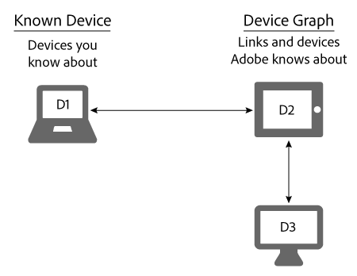

# Dispositivos conocidos{#known-devices}

Acerca de los dispositivos conocidos en Device Graph.

En el gráfico del dispositivo, se incluye el concepto de *`known device`*. Un dispositivo conocido es un dispositivo que un cliente utiliza para interactuar con su marca.

>[!NOTE]
>
>En el [!DNL Adobe Experience Cloud Device Co-op], términos como *`device`*, *`person`*, *`identity`* etc. tienen significados específicos. Por ejemplo, &quot;dispositivo&quot; puede hacer referencia a hardware físico como un teléfono o una tableta y a las aplicaciones que se ejecutan en ese hardware. Consulte la [glosario](../glossary.md#glossgroup-0f47d7fbd76c4759801f565f341a386c) para obtener definiciones.

## Apoyar objetivos con el dispositivo conocido {#section-80deae33660e4280ac65c659ceff5601}

El concepto de dispositivo conocido admite algunos objetivos esenciales para la creación y el mantenimiento de un [!DNL Device Co-op] programa. Un dispositivo conocido es aquel que [!DNL Device Co-op] el miembro conoce acerca de a partir de alguna interacción con un consumidor (por ejemplo, una visita al sitio o mediante una aplicación móvil). En función de estas acciones, la variable [!DNL Device Graph] vincula los dispositivos conocidos de un [!DNL Device Co-op] miembro a dispositivos aportados por otros usuarios [!DNL Device Co-op] miembros. Estos vínculos pueden ser [determinista o probabilístico](../processes/links.md#concept-58bb7ab25f904f5f98d645e35205c931). Esta ventaja [!DNL Device Co-op] miembros porque reciben:

* Más datos sobre sus dispositivos conocidos.
* Nueva información sobre otros dispositivos vinculados.

El [!DNL Device Graph] no proporcionará información sobre clústeres de dispositivos que un miembro de Device Co-op no haya visto.

## Objetivos de Device Co-op {#section-75aea5a102d54733aae2a7c6ee9ec6c7}

Tres objetivos principales animan el [!DNL Device Co-op]. Se incluyen:

* **Escala:** Comparta el número máximo de vínculos posibles en una variedad de casos de uso.
* **Equidad:** Asegúrese de que cada miembro del [!DNL Device Co-op] prestaciones de forma proporcional a sus aportaciones.

* **Confianza del consumidor:** Mantenga y aumente la confianza de los consumidores asegurándose de que la experiencia entre dispositivos implique marcas que ya conocen y en las que confían.

## Escala y dispositivo conocido {#section-67f734109762457ca62ec306284ea082}

Los siguientes métodos son las formas más comunes en que un dispositivo se califica como dispositivo conocido. Dados estos métodos, [!DNL Device Co-op] los miembros casi siempre tendrán al menos 1 dispositivo conocido. Esto permite alcanzar el objetivo de proporcionar la máxima escala a todos los miembros del [!DNL Device Co-op].

**Orgánico**

* Desde la visita de un cliente a su sitio o mediante el uso de su aplicación. Se trata de la calificación de datos de origen.
* Incorporando clientes desde un sistema CRM.

**Marketplace**

* Comprar datos de segmento de Audience Marketplace.
* De comprar datos de un proveedor de datos de terceros.

**Advertising**

Ganando inventario en una subasta y enviando un anuncio a un dispositivo. El dispositivo se convierte en un dispositivo conocido si el anuncio contiene un [!DNL Audience Manager] píxel.

## Casos de uso de dispositivos y equidad conocidos {#section-0543188729d845d6b95db70b8b25e9f8}

Miembros de la [!DNL Device Co-op] obtener vínculos acordes con sus contribuciones a la [!DNL Device Graph]. Compañías que aportan muchos dispositivos al [!DNL Device Graph] recibe más vínculos que los miembros que solo aportan algunos. Creemos que esto ayuda a hacer que [!DNL Device Co-op] justo para todos sus miembros. Veamos cómo funciona esto con los casos de uso grandes y pequeños que se describen a continuación.

**Marca A: caso de uso grande**

En este ejemplo, la marca A tiene 100 visitantes cada mes e inicia una nueva campaña de marca en varios dispositivos. Para simplificar, asuma el [!DNL Device Graph] sabe que todos los visitantes de la marca A están vinculados a un dispositivo adicional. Esto significa que la marca A podría llegar a otros 100 dispositivos. Además, la variable [!DNL Device Graph] contiene unos 200 dispositivos vinculados entre sí.

<table id="table_78C38DC522F94BC38C1DB73740C058AC"> 
 <thead> 
  <tr> 
   <th colname="col1" class="entry"> Dispositivos conocidos/mes </th> 
   <th colname="col2" class="entry"> Dispositivos vinculados recibidos de Device Co-op </th> 
   <th colname="col3" class="entry"> Total de dispositivos para Campaign </th> 
  </tr>
 </thead>
 <tbody> 
  <tr> 
   <td colname="col1"> 
100 
 </td> 
   <td colname="col2"> 
100 
 </td> 
   <td colname="col3"> 
200 
 </td> 
  </tr> 
 </tbody> 
</table>

**Marca B: Caso de uso pequeño**

En este ejemplo, la marca B tiene 100 visitantes cada mes e inicia una nueva campaña de marca en varios dispositivos. Para simplificar, asuma el [!DNL Device Graph] sabe que todos los visitantes de la marca B están vinculados a 50 dispositivos adicionales. Esto significa que la marca B podría alcanzar los 150 dispositivos. Además, la variable [!DNL Device Graph] contiene unos 1000 dispositivos vinculados entre sí.

<table id="table_A6C9CCF9C6564A89BA7060E075A8E73C"> 
 <thead> 
  <tr> 
   <th colname="col1" class="entry"> Dispositivos conocidos/mes </th> 
   <th colname="col2" class="entry"> Dispositivos vinculados recibidos de Device Co-op </th> 
   <th colname="col3" class="entry"> Total de dispositivos para Campaign </th> 
  </tr>
 </thead>
 <tbody> 
  <tr> 
   <td colname="col1"> 
100 
 </td> 
   <td colname="col2"> 
50 
 </td> 
   <td colname="col3"> 
150 
 </td> 
  </tr> 
 </tbody> 
</table>

>[!MORELIKETHIS]
>
>* [Dispositivos desconocidos](../processes/unknown-device.md#concept-95090d341cdc4c22ba4319d79d8f6e40)

