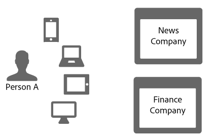
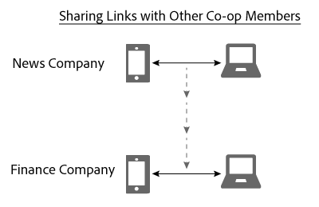

# Link sharing in the Device Graph{#link-sharing-in-the-device-graph}

Acerca del uso compartido de vínculos en Device Graph.

The [!DNL Device Graph] shares deterministic and probabilistic links with different members of the Adobe Experience Cloud Device Co-op. Link sharing is what makes the [!DNL Device Co-op] so powerful. Amplía lo que cada miembro sabe acerca de los dispositivos asociados a una persona anónima, pero solo si ha visto antes al menos unos de los dispositivos de dicha persona anónima.

## Device Graph summary review {#section-7858e9f61b5644c981ffb53626fcc19d}

Antes de comenzar, dediquemos un momento a revisar cómo funciona [!DNL Device Graph]. Members of the [!DNL Device Co-op] send data to the [!DNL Device Graph]. El [!DNL Device Graph] utiliza estos datos para construir la identidad de una persona a partir de vínculos  determinísticos y probabilísticos entre dispositivos. Como participante en [!DNL Device Co-op], estos vínculos le proporcionan información sobre la relación entre sus usuarios autenticados, otros usuarios y sus dispositivos. En la siguiente sección veremos cómo funciona esto.

## Link sharing example {#section-cb410d827cf14f76bc9b0bd4d31ed767}

El siguiente ejemplo demuestra la potencia del uso compartido de vínculos en Device Co-op. En este ejemplo tenemos dos empresas ficticias, Empresa de noticias y Empresa financiera. Both companies are members of the [!DNL Device Co-op]. Persona A es un consumidor que navega o inicia sesión en el sitio web de ambas empresas desde distintos dispositivos.

Como Persona A se ha autenticado en el sitio de noticias con su teléfono móvil y su tableta, Empresa de noticias lo tiene identificado con un ID de consumidor. La empresa envía este ID a [!DNL Device Graph] marcado criptográficamente. Empresa financiera ya ha visto antes estos dispositivos, pero Persona A nunca ha iniciado sesión en su sitio. Por tanto, Empresa financiera no sabe si estos dispositivos están relacionados, o su asociación con Persona A.

Como [!DNL Device Graph] tiene la marca criptográfica del ID de consumidor, reconoce que estos dispositivos están relacionados entre ellos y que están asociados a una persona en particular. Para una empresa que no participara en [!DNL Device Co-op], estas visitas parecerían proceder de dispositivos cualesquiera sin relación. En cualquier caso, una vez que [!DNL Device Graph] dispone del ID marcado:

* Sabe que el teléfono móvil y el portátil están vinculados.
* Es consciente de que Empresa financiera querría saber que el teléfono móvil y el portátil están vinculados.

Dadas estas condiciones, [!DNL Device Graph] comparte con Empresa financiera el vínculo que conecta ambos dispositivos para Empresa de noticias. Durante este proceso, [!DNL Device Graph] duplica el vínculo de un miembro de la cooperación y lo comparte con otro miembro.

At this point, the [!DNL Device Graph] performed its role successfully. Tanto Empresa de noticias como Empresa financiera tienen una imagen clara de una identidad. Ambas pueden dirigirse a Persona A con precisión en cualquiera de sus dispositivos.

## Privacy and link sharing {#section-7b566018b3304420a4b3e4c079826110}

Mantener la privacidad del consumidor y la integridad de los datos de los miembros de [!DNL Device Co-op] es crucial durante el proceso de compartir vínculos. Durante este proceso de identificar clientes y compartir vínculos, [!DNL Device Graph] no hizo nada de lo siguiente:

* Indicarle a Empresa financiera que el vínculo procedía de Empresa de noticias.
* Compartir el ID de cliente empleado por un miembro de [!DNL Device Co-op] con otro miembro.
* Proporcionar cualquier información distinta de que el dispositivo móvil y el portátil comparten un vínculo en común.

## Pasos siguientes {#section-ac6e61f1eb6e45b1bb4be8ece39147c7}

Leer la documentación sobre identidad, vinculación y uso compartido de vínculos debería darle una buena idea de cómo [!DNL Device Graph] organiza internamente los datos. Como paso siguiente, recomendamos echar un vistazo a nuestra documentación que describe cómo el concepto de un *`known device`* servicio proporciona vínculos entre dispositivos a los miembros de Device Co-op. Consulte Dispositivos  conocidos y dispositivos desconocidos.
