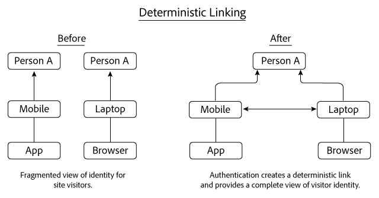
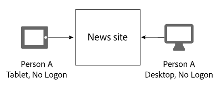
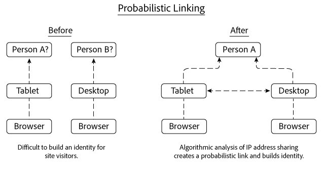
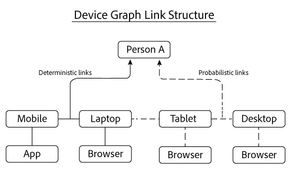

# Vínculos determinísticos y probabilísticos{#deterministic-and-probabilistic-links}

Cómo Device Graph analiza los datos determinísticos y probabilísticos para crear un mapa que vincule dispositivos.

En el [!DNL Device Graph], los procesos internos crean una jerarquía de identidad que asigna dispositivos y los conecta a personas individuales y anónimas. La salida del gráfico incluye vínculos entre dispositivos que puede utilizar para la segmentación junto con los datos expuestos en soluciones de Experience Cloud seleccionadas. Las soluciones de Adobe que trabajan con [!DNL Device Graph] Los datos de incluyen Analytics, Audience Manager, Media Optimizer y Target.

El [!DNL Device Graph] analiza datos determinísticos y probabilísticos para crear un mapa que vincule dispositivos. Los datos determinísticos vinculan dispositivos entre sí en función de la información de inicio de sesión con hash. Los datos probabilísticos vinculan dispositivos basándose en información como direcciones IP y otros metadatos. El [!DNL Device Graph] asocia los clústeres de dispositivos vinculados a una persona individual anónima. Estas conexiones permiten que los especialistas en marketing digital lleguen a las personas, en lugar de a los dispositivos. En el [!DNL Device Graph], el propietario de un dispositivo es la representación anónima de una persona en la vida real. Tanto los vínculos deterministas como los probabilísticos ayudan a crear una estructura de identidad del usuario.

>[!NOTE]
>
>En Adobe Experience Cloud Device Co-op, se utilizan términos como *dispositivo*, *persona*, y *identidad* tienen significados específicos. Por ejemplo, *dispositivo* puede hacer referencia a hardware físico, como un teléfono o una tableta, y a las aplicaciones que se ejecutan en ese hardware. Consulte la [glosario](../glossary.md#glossgroup-0f47d7fbd76c4759801f565f341a386c) para obtener definiciones.

## ¿Qué son los vínculos? {#section-2df4c6f01eba49369993146df0661f13}

Cuando hablamos de vínculos, es importante tener en cuenta cuáles son realmente en el contexto de la [!DNL Experience Cloud] Gráfico del dispositivo. En este contexto, los vínculos no son conexiones físicas entre dispositivos. En su lugar, un vínculo es la forma en que el gráfico de dispositivos asocia distintos dispositivos a la misma persona desconocida. Por ejemplo, supongamos que tenemos un teléfono móvil y un navegador de escritorio. El teléfono y el navegador pueden considerarse &quot;vinculados&quot; una vez que Device Graph determina que ambos dispositivos los utiliza la misma persona desconocida. Como leerá a continuación, el gráfico de dispositivos crea identidades con vínculos deterministas y probabilísticos. Y, en el gráfico de dispositivos, el propietario de un dispositivo es la representación anónima de una persona en la vida real.

## Vínculos deterministas {#section-33d41e828a674b398e36fe63da20ac09}

Los vínculos deterministas asocian un dispositivo a una persona en función de un evento de autenticación (por ejemplo, una acción de inicio de sesión en un sitio desde un dispositivo). Esta acción crea un identificador anónimo denominado ID de consumidor. Echemos un vistazo a cómo funciona la vinculación determinista. En este ejemplo, la persona A inicia sesión en un sitio de noticias a través de una aplicación en su dispositivo móvil. Más tarde ese mismo día, la persona A vuelve a iniciar sesión, pero esta vez a través de un explorador en su portátil.

En función de la información de inicio de sesión, Device Graph:

* Sabe que la persona A se ha autenticado en el sitio de noticias con una combinación de teléfono/aplicación móvil y equipo portátil/explorador.
* Vincula estos dispositivos a la persona A.
* Crea una identidad basada en dispositivos vinculados asociados a una persona anónima.

>[!NOTE]
>
>Ni el [!DNL Adobe Experience Cloud Device Co-op] o el [!DNL Device Graph] recibe información de autenticación real o información de identificación personal (PII) en estos datos. Miembros de la [!DNL Experience Cloud Device Co-op], pase los ID de consumidor únicos con hash criptográfico al gráfico de dispositivos. El ID de consumidor representa a un usuario autenticado en el gráfico y protege la privacidad del consumidor.

## Vínculos probabilísticos {#section-5f5aa755da984f9d851f7cb380262998}

Los vínculos probabilísticos conectan un dispositivo a una persona de forma algorítmica, según características y metadatos como:

* Comportamiento de navegación
* Direcciones IP
* Sistemas operativos
* Identificadores IDFA y GAID

Veamos cómo funciona la vinculación probabilística. En este ejemplo, la persona A navega a un sitio de noticias en su tableta y, posteriormente, desde un equipo de escritorio. Mientras navega, la persona A no inicia sesión en el sitio de noticias. Durante cada visita independiente, la tableta y el equipo de escritorio comparten la misma dirección IP.

En función de esta información, la variable [!DNL Device Graph] evalúa los patrones de uso compartido de direcciones IP entre ambos dispositivos y vincula estos dispositivos si los resultados sugieren que pertenecen a la persona A. El resultado final es una jerarquía de identidad derivada de los cálculos de probabilidad algorítmica.

En este ejemplo, Device Graph vinculó ambos dispositivos después de usarlos para acceder al mismo sitio de noticias. Sin embargo, los dispositivos no tienen que verse en el mismo sitio para que se vinculen. Para ilustrar este punto, supongamos que cada dispositivo de este ejemplo visita sitios web completamente diferentes. El [!DNL Device Graph] El algoritmo aún puede crear un vínculo probabilístico en función de su dirección IP compartida y de un análisis de otros datos. Este proceso es lo que ayuda a que la vinculación probabilística sea tan eficaz para los miembros de [!DNL Experience Cloud] Cooperación entre dispositivos.

## Ambos tipos de datos proporcionan valor {#section-43d22d8c10634edcb261e7bda6fdf323}

Los datos determinísticos y probabilísticos se complementan entre sí. Por el contrario, un gráfico de dispositivos que solo incluye datos deterministas le ofrece una vista limitada de la identidad de una persona. Sin autenticación, un gráfico de dispositivos no puede hablarle de otros dispositivos y de las personas que exploran el sitio. Los datos probabilísticos pueden establecer estas conexiones y ayudarle a llegar a dispositivos, personas y hogares no autenticados.

Sin embargo, los datos deterministas también son importantes. Puede, por ejemplo, mejorar la toma de decisiones probabilísticas eliminando los enlaces falsos generados en lugares donde las señales probabilísticas son abundantes y superpuestas (por ejemplo, cafeterías, bibliotecas, aeropuertos, etc.).

Con ambos tipos de datos, el gráfico de dispositivos le ofrece una imagen más completa de la identidad de una persona que con cualquier tipo solo.

